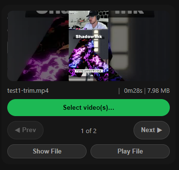
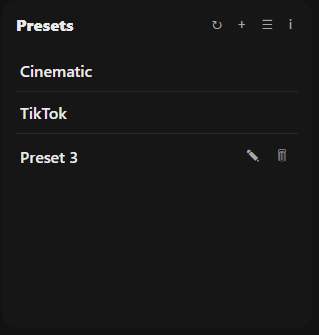

# AutoTrim

A standalone desktop app to automatically remove silent parts from videos.  

## Features

### Histogram & Parameters

|  |  |
|-----------------------------------------------|---------------------------------------------------|
| **Visualization**: See your video's loudness distribution instantly.   **Interaction**: Click and drag on the chart to set the noise floor.   **Thresholding**: Any sound below this level is silence. | **Noise**: Sets the loudness threshold for silence.   **Silence**: Minimum duration before trimming occurs.   **Padding**: Extra time before and after each clip.   **Clip**: Minimum length of a segment to keep. |

### Batches & Presets

|  |  |
|-----------------------------------------------|---------------------------------------------------|
| **Batch Processing**: Load an entire folder of videos at once. AutoTrim's clean interface lets you easily navigate through your batch using the Prev and Next buttons, preparing all your files for a single, streamlined trimming session. | **Preset Parameters**: Found the perfect settings for your style? Save them as a preset for one-click access in the future. The app comes with built-in presets for common styles like "Cinematic" and "TikTok" to get you started instantly. |

## Other Features

|  **Real-Time Progress** | **Hardware Acceleration** |
|------------------------|----------------------------|
| A progress bar shows analysis, silence detection, and rendering. | Uses NVIDIA (NVENC) hardware encoding for faster processing. |

## How to Use

1. Download the application for your operating system.  
2. Unzip the file and run the **AutoTrim** executable.  
3. Click **Select video(s)...** to load a file.  
4. Use the histogram and sliders to adjust the trimming parameters.  
5. Click **Start** to begin processing. Your new video will be saved by default in your **Downloads** folder.
