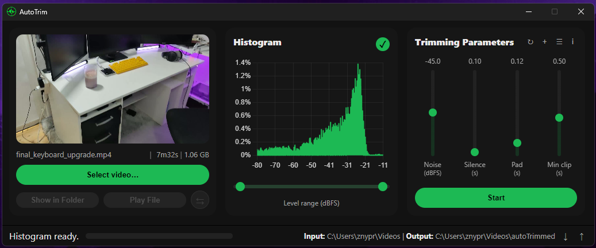
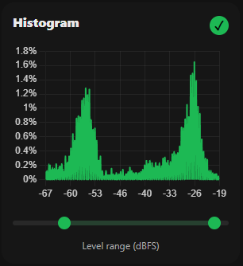
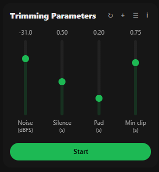
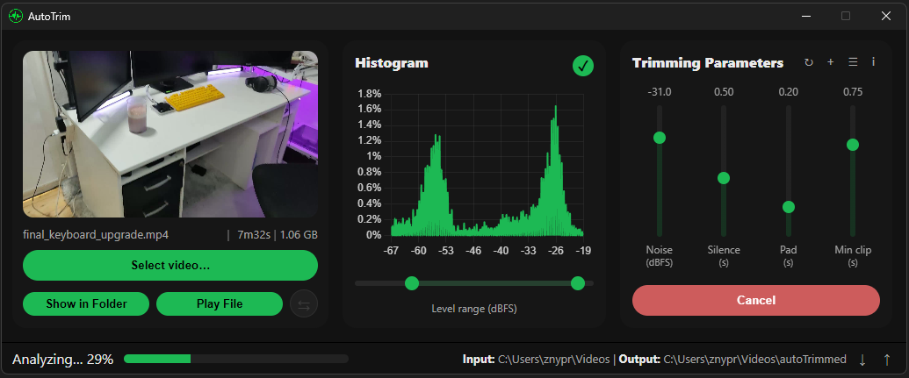

# AutoTrim

A standalone desktop app to automatically remove silent parts from videos.  

## Features

### Histogram & Parameters

|  |  |
|-----------------------------------------------|---------------------------------------------------|
| **Visualization**: See your video's loudness distribution instantly.   **Interaction**: Click and drag on the chart to set the noise floor.   **Thresholding**: Any sound below this level is silence. | **Noise**: Sets the loudness threshold for silence.   **Silence**: Minimum duration before trimming occurs.   **Padding**: Extra time before and after each clip.   **Clip**: Minimum length of a segment to keep. |

## Other Features

| **Parameter Presets** | **Real-Time Progress** | **Hardware Acceleration** |
|------------------------|-------------------------|----------------------------|
| Save your favorite slider settings as presets for quick reuse. | A progress bar shows analysis, silence detection, and rendering. | Uses NVIDIA (NVENC) hardware encoding for faster processing. |

## How to Use

1. Download the application for your operating system.  
2. Unzip the file and run the **AutoTrim** executable.  
3. Click **Select video...** to load a file.  
4. Use the histogram and sliders to adjust the trimming parameters.  
5. Click **Start** to begin processing. Your new video will be saved in your **Downloads** folder.
